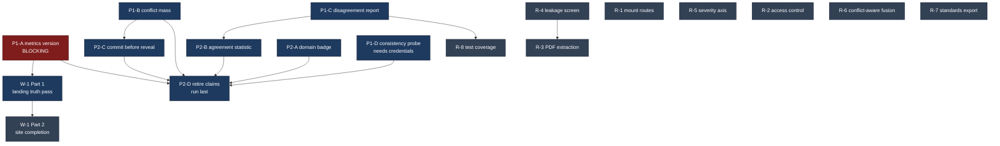

# ARBITER build prompts

Each file in `pre-submission/` and `product/` is a **self-contained prompt**. Open a fresh
Claude Code session in this repository, paste one whole file, and let it run. They assume
no other context and no memory of each other, so you can run them in any session, in any
order the dependency table allows, and hand different ones to different people.

Written 2026-08-14 against `origin/main`. The five documents in `inventory/` are the
factual basis every prompt was written from.

---

## Do this one first

**`pre-submission/P1-A-metrics-version-reconciliation.md`**

`results/metrics.json` carries `provenance.rulesetVersion: "1.0"` and reports
`balancedAccuracy: 0.75` with confusion `tp 4 / fp 0 / tn 0 / fn 0` and
`singleClass: true`. The About and Validation tabs render those figures, and the marketing
page hardcodes `0.750` in five more places. `HANDOVER.md` section 13.1 declares that target
invalid, and `rules/ruleset-v2.0.json` re-registered it on 2026-08-09.

So the shipped surfaces display the exact number the team's own published correction exists
to withdraw. A judge who opens the About tab during the demo sees it. Everything else in
this folder is worth less than fixing that.

---

## Before 16 August

Two tracks that share no files, because `services/api` never imports `@arbiter/engine`.
The engine and web work and the API and deliberation work can run fully in parallel.

| # | prompt | effort | depends on | track |
|---|---|---|---|---|
| 1 | `P1-A-metrics-version-reconciliation` | 2 to 3 hours (Path B) | nothing | web |
| 2 | `P1-C-expose-disagreement-report` | 3 to 4 hours | nothing | API + deliberation |
| 3 | `P1-B-render-conflict-mass` | 2 to 3 hours | nothing | web |
| 4 | `P1-D-run-consistency-probe` | 1 hour plus model spend | credentials | either |
| 5 | `P2-A-applicability-domain-badge` | 2 to 3 hours | nothing | web |
| 6 | `P2-B-agreement-statistic` | half a day | P1-C | API + deliberation |
| 7 | `P2-C-commit-before-reveal` | half a day | better after P1-B | web |
| 8 | `W-1-landing-site-truth-pass` (Part 1 only) | 3 to 4 hours | P1-A | web |
| 9 | `P2-D-retire-invalidated-claims` | 2 to 3 hours | run **last** | either |

**P2-D goes last on purpose.** Every other prompt writes new copy, and that sweep is what
catches what they introduce.

**If time compresses**, cut in this order: P2-C first, since `apps/deliberation` already
demonstrates the forcing function through blind submission and the research angle survives
without the web app change; then P2-B's cross-case kappa, keeping the per-case figure;
then P2-A. **Never cut P1-A, P1-B or P1-C.** P1-A is the invalidated number. P1-B and P1-C
are both features that are already computed and shipped to nobody, which is the cheapest
value in the repository.

## After submission

| # | prompt | effort | depends on |
|---|---|---|---|
| 1 | `R-1-mount-interpret-navigate-routes` | 2 to 4 hours | nothing. Small, and a live bug. |
| 2 | `R-4-leakage-screen` | 1 day | nothing. Blocking for any prediction claim. |
| 3 | `R-3-pdf-extraction` | 3 to 5 days | do R-4 first |
| 4 | `R-5-severity-axis` | 4 to 6 days | nothing |
| 5 | `R-8-test-coverage` | 2 to 3 days | do P1-C first |
| 6 | `R-2-access-control-and-deployment` | 3 to 5 days | blocking before real sponsor data |
| 7 | `W-1-landing-site-truth-pass` (Part 2) | 1 to 2 days | Part 1 |
| 8 | `R-6-conflict-aware-fusion` | 1 to 2 days | nothing. Rigor, not credibility. |
| 9 | `R-7-standards-export` | 2 days for PROV-O | nothing. Lowest value. |

---

## Dependencies

---

## What these prompts do not cover, and why

The Evidence-Integrated Playbook names four things not to start before submission. None
has a prompt in `pre-submission/`, and that is deliberate:

- **Sharing the engine between the two apps.** `apps/deliberation` depends on `react` and
  `react-dom` only and has no engine dependency. Introducing one days before a deadline
  changes the dependency graph of a working system for no demo benefit.
- **Live adjudication against a real model.** The wiring is real and the words are a stub,
  and the interface says so on screen. P1-D measures the model's consistency without making
  it the decider.
- **PDF extraction.** Multi-day. It is `R-3`, and it is post-submission.
- **Surface 2's live consistency run.** The handover says that button stays disabled even
  if `metric2a_llmConsistency` one day carries real numbers.

Also absent by choice: conformal prediction for applicability domains (needs a written
coverage claim against the calibration split), federated rule exchange (governance-heavy
and unproven, and the research brief that suggested it calls it a vision slide), endpoints
two through four, and CDISC SEND ingestion (there is no SEND data in this repository, and
`R-7` says so plainly rather than sketching a mapping and calling it an integration).

---

## The inventory

`inventory/` holds five documents, roughly 330KB, written by agents that read the code
rather than the specifications:

| file | covers |
|---|---|
| `engine-and-measurement.md` | `packages/engine`, `apps/harness`, `rules/`, `tools/`. Includes a full trace of how `results/metrics.json` is produced and exactly what regenerating it under v2.0 would break. |
| `web-app.md` | `apps/web`, all seven tabs, and an exhaustive list of every site that reads a metrics field with the sentence it produces. |
| `api-and-deliberation.md` | `services/api` route table, the store seam, the access matrix, and every deliberation screen. |
| `landing-site.md` | `apps/landing` section by section, plus a claims audit of every number on the marketing page. |
| `data-and-product-gaps.md` | `data/`, the four human manifests, the checklist, and what extraction and the leakage screen actually require. |

Read the relevant one before anything non-trivial. They contain line numbers and absence
claims that the prompts compress, and several findings in them are things no specification
in this repository records.

---

## House rules every prompt assumes

- No em dashes anywhere. Six commits exist solely to remove them.
- "review-ready evidence package", not "regulator-ready dossier". "positions" and
  "sign-off", not "voting" or "majority". "hash-chained audit log", not "blockchain".
- `packages/engine/src` is pure: no `Date`, no `Math.random`, no `node:` imports, no
  filesystem. A policy it needs is a constant in the engine plus a registered JSON file the
  harness drift-guards.
- Registered rulesets are immutable. A change mints a new version with its own hash and a
  written rationale.
- Pre-registration before measurement. A number chosen after seeing a score is a
  description.
- Counts never decide. An agreement statistic is context for a later reader and may never
  gate an outcome.
- Every reported number names its denominator, its class balance and the prompt hash that
  produced it. Omitting exactly that is what produced the 0.750 headline.
- TDD: failing test, watch it fail, minimal implementation, watch it pass, commit.
